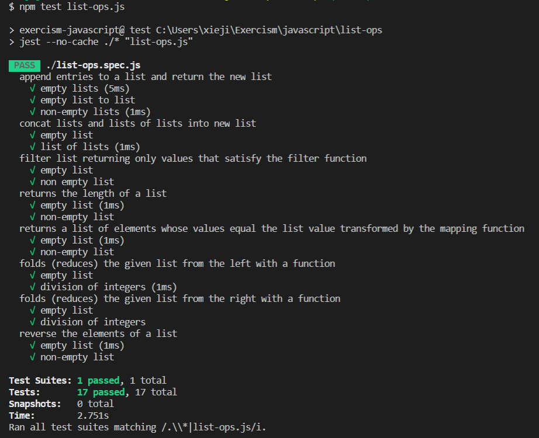

# List Ops

Implement basic list operations.

In functional languages list operations like `length`, `map`, and
`reduce` are very common. Implement a series of basic list operations,
without using existing functions.

The precise number and names of the operations to be implemented will be 
track dependent to avoid conflicts with existing names, but the general
operations you will implement include:

* `append` (*given two lists, add all items in the second list to the end of the first list*);
* `concatenate` (*given a series of lists, combine all items in all lists into one flattened list*);
* `filter` (*given a predicate and a list, return the list of all items for which `predicate(item)` is True*);
* `length` (*given a list, return the total number of items within it*);
* `map` (*given a function and a list, return the list of the results of applying `function(item)` on all items*);
* `foldl` (*given a function, a list, and initial accumulator, fold (reduce) each item into the accumulator from the left using `function(accumulator, item)`*);
* `foldr` (*given a function, a list, and an initial accumulator, fold (reduce) each item into the accumulator from the right using `function(item, accumulator)`*);
* `reverse` (*given a list, return a list with all the original items, but in reversed order*);

## Setup

Go through the setup instructions for Javascript to install the necessary
dependencies:

[https://exercism.io/tracks/javascript/installation](https://exercism.io/tracks/javascript/installation)

## Requirements

Install assignment dependencies:

```bash
$ npm install
```

## Making the test suite pass

Execute the tests with:

```bash
$ npm test
```

In the test suites all tests but the first have been skipped.

Once you get a test passing, you can enable the next one by changing `xtest` to
`test`.


## Submitting Incomplete Solutions

It's possible to submit an incomplete solution so you can see how others have
completed the exercise.


## Result


