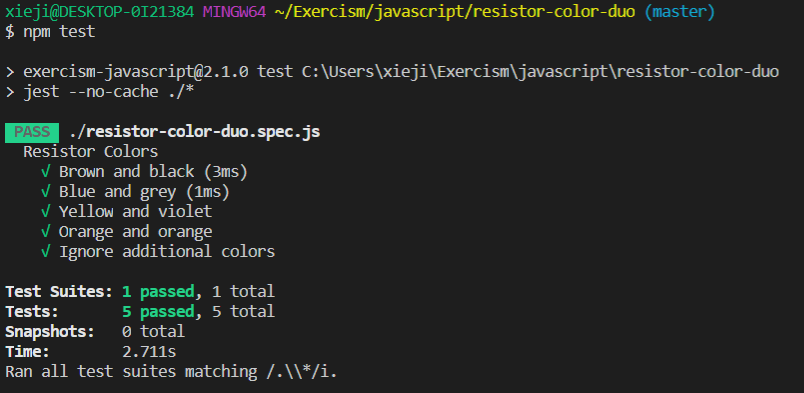

# Resistor Color Duo

If you want to build something using a Raspberry Pi, you'll probably use _resistors_. For this exercise, you need to know two things about them:

* Each resistor has a resistance value.
* Resistors are small - so small in fact that if you printed the resistance value on them, it would be hard to read.

To get around this problem, manufacturers print color-coded bands onto the resistors to denote their resistance values. Each band has a position and a numeric value. For example, if they printed a brown band (value 1) followed by a green band (value 5), it would translate to the number 15.

In this exercise you are going to create a helpful program so that you don't have to remember the values of the bands. The program will take color names as input and output a two digit number, even if the input is more than two colors!

The colors are mapped to the numbers from 0 to 9 in the sequence:
Black - Brown - Red - Orange - Yellow - Green - Blue - Violet - Grey - White

From the example above:
brown-green should return 15
brown-green-violet should return 15 too, ignoring the third color.

## Setup

Go through the setup instructions for Javascript to
install the necessary dependencies:

[https://exercism.io/tracks/javascript/installation](https://exercism.io/tracks/javascript/installation)

## Requirements

Install assignment dependencies:

```bash
$ npm install
```

## Making the test suite pass

Execute the tests with:

```bash
$ npm test
```

In the test suites all tests but the first have been skipped.

Once you get a test passing, you can enable the next one by
changing `xtest` to `test`.

## Source

Maud de Vries, Erik Schierboom [https://github.com/exercism/problem-specifications/issues/1464](https://github.com/exercism/problem-specifications/issues/1464)

## Submitting Incomplete Solutions

It's possible to submit an incomplete solution so you can see how others have completed the exercise.

## Test Result

