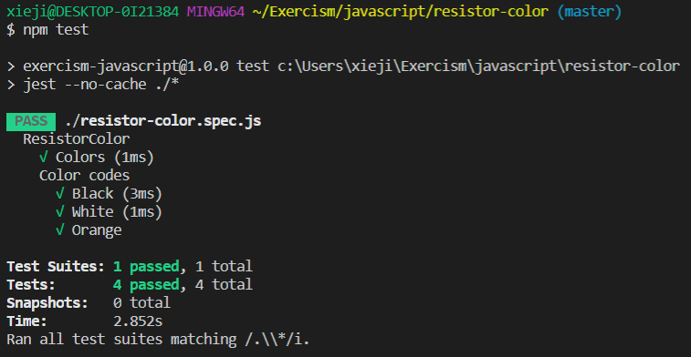

# Resistor Color

Resistors have color coded bands, where each color maps to a number. The first 2 bands of a resistor have a simple encoding scheme: each color maps to a single number.

These colors are encoded as follows:

- Black: 0
- Brown: 1
- Red: 2
- Orange: 3
- Yellow: 4
- Green: 5
- Blue: 6
- Violet: 7
- Grey: 8
- White: 9

Mnemonics map the colors to the numbers, that, when stored as an array, happen to map to their index in the array: Better Be Right Or Your Great Big Values Go Wrong.

More information on the color encoding of resistors can be found in the [Electronic color code Wikipedia article](https://en.wikipedia.org/wiki/Electronic_color_code)

## Setup

Go through the setup instructions for Javascript to install the necessary
dependencies:

[https://exercism.io/tracks/javascript/installation](https://exercism.io/tracks/javascript/installation)

## Requirements

Install assignment dependencies:

```bash
$ npm install
```

## Making the test suite pass

Execute the tests with:

```bash
$ npm test
```

In the test suites all tests but the first have been skipped.

Once you get a test passing, you can enable the next one by changing `xtest` to
`test`.

## Source

Maud de Vries, Erik Schierboom [https://github.com/exercism/problem-specifications/issues/1458](https://github.com/exercism/problem-specifications/issues/1458)

## Submitting Incomplete Solutions

It's possible to submit an incomplete solution so you can see how others have
completed the exercise.

## Test Result

