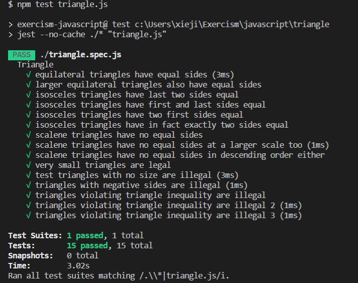

# Triangle

Determine if a triangle is equilateral, isosceles, or scalene.

An _equilateral_ triangle has all three sides the same length.

An _isosceles_ triangle has at least two sides the same length. (It is sometimes
specified as having exactly two sides the same length, but for the purposes of
this exercise we'll say at least two.)

A _scalene_ triangle has all sides of different lengths.

## Note

For a shape to be a triangle at all, all sides have to be of length > 0, and
the sum of the lengths of any two sides must be greater than or equal to the
length of the third side. See [Triangle Inequality](https://en.wikipedia.org/wiki/Triangle_inequality).

## Dig Deeper

The case where the sum of the lengths of two sides _equals_ that of the
third is known as a _degenerate_ triangle - it has zero area and looks like
a single line. Feel free to add your own code/tests to check for degenerate triangles.

## Setup

Go through the setup instructions for Javascript to install the necessary
dependencies:

[https://exercism.io/tracks/javascript/installation](https://exercism.io/tracks/javascript/installation)

## Requirements

Install assignment dependencies:

```bash
$ npm install
```

## Making the test suite pass

Execute the tests with:

```bash
$ npm test
```

In the test suites all tests but the first have been skipped.

Once you get a test passing, you can enable the next one by changing `xtest` to
`test`.

## Source

The Ruby Koans triangle project, parts 1 & 2 [http://rubykoans.com](http://rubykoans.com)

## Submitting Incomplete Solutions

It's possible to submit an incomplete solution so you can see how others have
completed the exercise.

## Result

